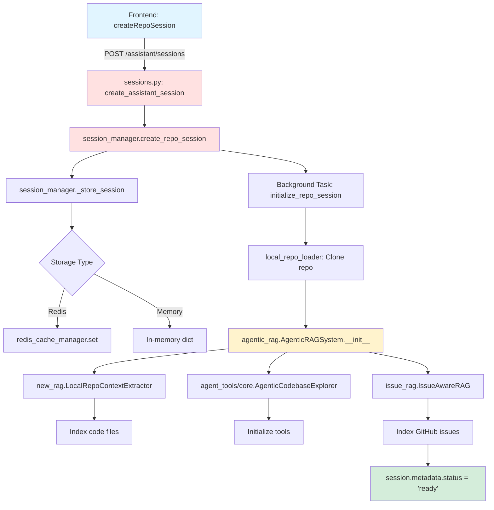
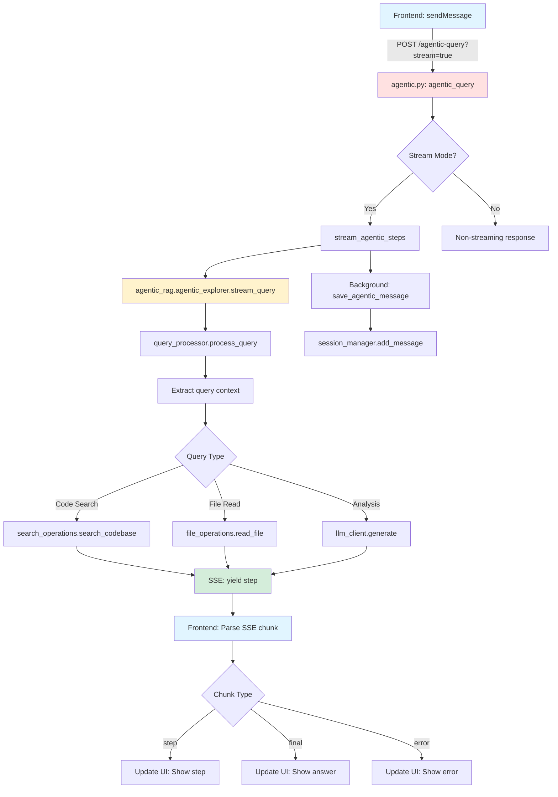
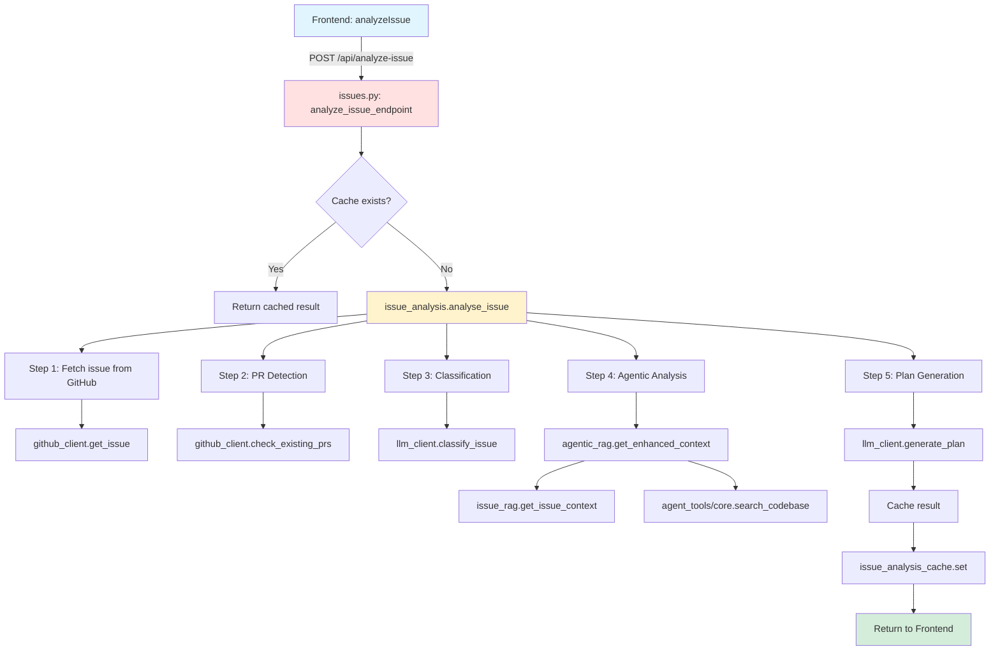
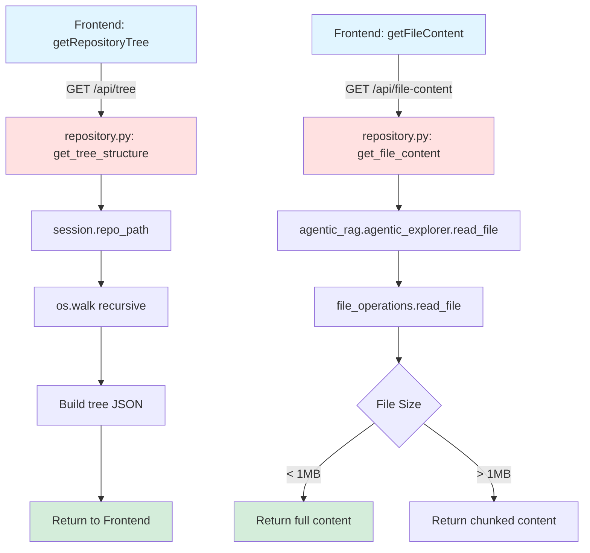

# Critical Path Call Graph
## Visual Mapping of Frontend → Backend Dependencies

---

## Graph 1: Session Creation Flow



### Module Dependencies (Session Creation)

```
session_manager.py (300 LOC)
    ├── github_client.py (400 LOC)
    ├── agentic_rag.py (800 LOC)
    ├── local_repo_loader.py (200 LOC)
    └── cache/redis_cache_manager.py (200 LOC)

agentic_rag.py
    ├── new_rag.py (600 LOC)
    ├── agent_tools/core.py (350 LOC)
    └── issue_rag.py (700 LOC)

agent_tools/core.py
    ├── agent_tools/file_operations.py (400 LOC)
    ├── agent_tools/search_operations.py (400 LOC)
    ├── agent_tools/query_processor.py (550 LOC)
    ├── agent_tools/prompts.py (400 LOC)
    └── llm_client.py (550 LOC)

Total: ~5,850 LOC
```

---

## Graph 2: Agentic Query Flow (Chat)



### Module Dependencies (Agentic Query)

```
agentic.py (792 LOC)
    ├── agentic_rag.py (800 LOC)
    └── session_manager.py (300 LOC)

agentic_rag.agentic_explorer (agent_tools/core.py)
    ├── query_processor.py (550 LOC)
    │   ├── Extract file mentions
    │   ├── Detect query complexity
    │   └── Parse code references
    ├── search_operations.py (400 LOC)
    │   ├── Semantic search
    │   ├── AST-based search
    │   └── File pattern matching
    ├── file_operations.py (400 LOC)
    │   ├── Read file content
    │   ├── Parse code structure
    │   └── Extract docstrings
    ├── prompts.py (400 LOC)
    │   ├── System prompts
    │   ├── Query templates
    │   └── Response formatting
    ├── response_handling.py (550 LOC)
    │   ├── Stream formatting
    │   ├── Step creation
    │   └── Chunk serialization
    └── llm_client.py (550 LOC)
        ├── Anthropic provider
        ├── OpenAI provider
        └── Streaming interface

Total: ~4,750 LOC
```

### SSE Streaming Protocol

```
Python (agentic.py):
    async def stream_agentic_steps():
        yield f"data: {json.dumps(chunk)}\n\n"

Frontend (api.ts):
    async function* sendMessage():
        while (chunk = await reader.read()):
            if (line.startsWith('data: ')):
                yield JSON.parse(line.substring(6))

Chunk Types:
    - type: "step"      → AgenticStep (thought/action/observation)
    - type: "final"     → Final answer + all steps
    - type: "error"     → Error message
    - type: "status"    → Status update
```

---

## Graph 3: Issue Analysis Flow



### Module Dependencies (Issue Analysis)

```
issues.py (720 LOC)
    ├── github_client.py (400 LOC)
    ├── issue_analysis.py (module not found, inline in issues.py)
    ├── agentic_rag.py (800 LOC)
    ├── llm_client.py (550 LOC)
    └── cache/redis_cache_manager.py (200 LOC)

issue_rag.py (700 LOC)
    ├── github_client.py (400 LOC)
    ├── patch_linkage.py (300 LOC)
    └── models.py (150 LOC)

Total: ~3,300 LOC
```

### Issue Analysis Steps

```python
# Step-by-step breakdown
steps = [
    {
        "step": "PR Detection",
        "status": "completed",
        "result": {
            "has_existing_prs": bool,
            "pr_number": int,
            "pr_state": str
        }
    },
    {
        "step": "Issue Classification",
        "status": "completed",
        "result": {
            "category": "bug|feature|enhancement",
            "confidence": float,
            "reasoning": str
        }
    },
    {
        "step": "Codebase Analysis",
        "status": "completed",
        "result": {
            "key_files": ["file1.py", "file2.py"],
            "agentic_analysis": {...}
        }
    },
    {
        "step": "Solution Planning",
        "status": "completed",
        "result": {
            "plan_markdown": str
        }
    }
]
```

---

## Graph 4: Repository Operations



### Module Dependencies (Repository Operations)

```
repository.py (635 LOC)
    ├── session_manager.py (300 LOC)
    └── agentic_rag.agentic_explorer
        └── file_operations.py (400 LOC)

Total: ~1,335 LOC
```

---

## Graph 5: Complete Dependency Tree

```
┌─────────────────────────────────────────────────────────────────┐
│                         Frontend Layer                          │
│  (React components call 17 API functions from /lib/api.ts)     │
└────────────────────────┬────────────────────────────────────────┘
                         │
                         ▼
┌─────────────────────────────────────────────────────────────────┐
│                     FastAPI Routers Layer                       │
│  ┌────────────┬────────────┬──────────────┬───────────┐        │
│  │ sessions.py│ agentic.py │repository.py │issues.py  │        │
│  │  (447 LOC) │ (792 LOC)  │  (635 LOC)   │(720 LOC)  │        │
│  └────────────┴────────────┴──────────────┴───────────┘        │
└────────────────────────┬────────────────────────────────────────┘
                         │
                         ▼
┌─────────────────────────────────────────────────────────────────┐
│                    Dependencies Layer                           │
│  (dependencies.py - Shared service instances)                   │
│                                                                  │
│  ┌──────────────────┬──────────────────┬──────────────────┐    │
│  │ session_manager  │  github_client   │  agentic_rag     │    │
│  │ llm_client       │  chunk_store     │  conversation_   │    │
│  └──────────────────┴──────────────────┴──────────────────┘    │
└────────────────────────┬────────────────────────────────────────┘
                         │
                         ▼
┌─────────────────────────────────────────────────────────────────┐
│                   Core Business Logic Layer                     │
│                                                                  │
│  ┌─────────────────────────────────────────────────────┐       │
│  │ session_manager.py (300 LOC)                        │       │
│  │   ├── create_repo_session()                         │       │
│  │   ├── initialize_repo_session() [background]        │       │
│  │   ├── add_message()                                 │       │
│  │   └── get_session()                                 │       │
│  └─────────────────────────────────────────────────────┘       │
│                         │                                        │
│                         ▼                                        │
│  ┌─────────────────────────────────────────────────────┐       │
│  │ agentic_rag.py (800 LOC)                            │       │
│  │   ├── AgenticRAGSystem.__init__()                   │       │
│  │   ├── _initialize_composite_retriever()             │       │
│  │   └── get_enhanced_context()                        │       │
│  └─────────────────────────────────────────────────────┘       │
│                         │                                        │
│                         ▼                                        │
│  ┌────────────┬────────────────┬──────────────────────┐        │
│  │ new_rag.py │ issue_rag.py   │ agent_tools/core.py  │        │
│  │ (600 LOC)  │ (700 LOC)      │ (350 LOC)            │        │
│  │            │                │  AgenticCodebase     │        │
│  │ LocalRepo  │ IssueAwareRAG  │  Explorer            │        │
│  │ Context    │                │                      │        │
│  │ Extractor  │                │                      │        │
│  └────────────┴────────────────┴──────────────────────┘        │
└────────────────────────┬────────────────────────────────────────┘
                         │
                         ▼
┌─────────────────────────────────────────────────────────────────┐
│                   Support Modules Layer                         │
│                                                                  │
│  ┌─────────────────┬─────────────────┬────────────────┐        │
│  │ file_operations │ search_ops      │ query_processor│        │
│  │ (400 LOC)       │ (400 LOC)       │ (550 LOC)      │        │
│  └─────────────────┴─────────────────┴────────────────┘        │
│                                                                  │
│  ┌─────────────────┬─────────────────┬────────────────┐        │
│  │ prompts.py      │ response_       │ llm_client.py  │        │
│  │ (400 LOC)       │ handling        │ (550 LOC)      │        │
│  │                 │ (550 LOC)       │                │        │
│  └─────────────────┴─────────────────┴────────────────┘        │
│                                                                  │
│  ┌─────────────────┬─────────────────┬────────────────┐        │
│  │ github_client   │ triage_bot      │ commit_index   │        │
│  │ (400 LOC)       │ (500 LOC)       │ (400 LOC)      │        │
│  └─────────────────┴─────────────────┴────────────────┘        │
│                                                                  │
│  ┌─────────────────┬─────────────────┬────────────────┐        │
│  │ local_repo_     │ patch_linkage   │ cache/redis    │        │
│  │ loader          │ (300 LOC)       │ (200 LOC)      │        │
│  │ (200 LOC)       │                 │                │        │
│  └─────────────────┴─────────────────┴────────────────┘        │
└─────────────────────────────────────────────────────────────────┘
```

---

## Module Import Graph (Tier 1 Only)

```python
# Tier 1: Frontend-facing modules
session_manager.py
    ├── from .github_client import GitHubIssueClient
    ├── from .unified_rag import AgenticRAGSystem
    ├── from .config import settings
    └── from .cache.redis_cache_manager import EnhancedCacheManager

unified_rag.py (consolidated from new_rag.py, issue_rag.py, agentic_rag.py)
    ├── from .local_repo_loader import clone_repo_to_temp_persistent
    ├── from .agent_tools import AgenticCodebaseExplorer
    ├── from .github_client import GitHubIssueClient
    └── from .commit_index import CommitIndexManager

agent_tools/core.py (AgenticCodebaseExplorer)
    ├── from .file_operations import *
    ├── from .search_operations import *
    ├── from .query_processor import QueryProcessor
    ├── from .prompts import *
    ├── from .response_handling import *
    ├── from ..llm_client import LLMClient
    └── from ..commit_index import CommitIndexManager

issue_rag.py
    ├── from .github_client import GitHubIssueClient
    ├── from .patch_linkage import DiffDoc, PatchLinkageIndexer
    ├── from .models import IssueDoc, IssueSearchResult
    └── from .cache.redis_cache_manager import EnhancedCacheManager

new_rag.py
    ├── from .llm_client import LLMClient
    ├── from .language_config import LANGUAGE_CONFIGS
    └── from .local_repo_loader import clone_or_update_repo

triage_bot.py
    ├── from .github_client import GitHubIssueClient
    └── from .config import settings

github_client.py
    ├── import httpx
    └── from .models import Issue, IssueResponse

llm_client.py
    ├── import anthropic
    ├── import openai
    └── from .config import settings
```

---

## Unused Module Graph (Can Skip)

```
┌─────────────────────────────────────────────────────────────┐
│                    UNUSED FEATURES                          │
│  (NOT in critical path - can skip migration)                │
└─────────────────────────────────────────────────────────────┘

┌────────────────────────────────────────┐
│  Workflow System (3,000 LOC)           │
│  ├── llamaindex_workflows.py          │
│  ├── llamaindex_comprehensive_         │
│  │   workflow.py                       │
│  ├── workflow_state.py                 │
│  ├── workflow_agents.py                │
│  └── Router: /workflows/* (6 endpoints)│
│                                        │
│  Status: Backend exists, frontend     │
│          never calls                   │
└────────────────────────────────────────┘

┌────────────────────────────────────────┐
│  Timeline Features (2,000 LOC)         │
│  ├── api/routers/timeline.py          │
│  ├── agent_tools/git_operations.py    │
│  └── 11 unused endpoints               │
│                                        │
│  Status: Entire router unused          │
└────────────────────────────────────────┘

┌────────────────────────────────────────┐
│  Founding Member Agent (600 LOC)       │
│  ├── founding_member_agent.py          │
│  └── Router: /founder/sessions/*       │
│                                        │
│  Status: Feature not exposed to        │
│          frontend                      │
└────────────────────────────────────────┘

┌────────────────────────────────────────┐
│  Context-Aware Tools (1,000 LOC)       │
│  ├── agent_tools/context_aware_        │
│  │   tools.py                          │
│  └── Advanced context management       │
│                                        │
│  Status: Not called by                 │
│          AgenticCodebaseExplorer       │
└────────────────────────────────────────┘

┌────────────────────────────────────────┐
│  Other Unused (3,000 LOC)              │
│  ├── tool_registry.py                  │
│  ├── agent_pool.py                     │
│  ├── context_manager.py                │
│  ├── enhanced_persistence.py           │
│  ├── conversation_memory.py            │
│  ├── response_formatter.py             │
│  ├── analyzer.py                       │
│  ├── classifier.py                     │
│  ├── plan_generator.py                 │
│  └── pr_checker.py                     │
└────────────────────────────────────────┘
```

---

## Data Flow: Session Creation → Chat

```
1. User opens frontend
   ↓
2. Frontend: createRepoSession("https://github.com/apache/airflow")
   ↓
3. POST /assistant/sessions
   ├── Validate repo URL
   ├── Create session_id
   ├── session_manager.create_repo_session()
   │   ├── Parse owner/repo from URL
   │   ├── Create session dict
   │   └── Store in Redis (or memory)
   ├── Background task: initialize_repo_session()
   │   ├── Clone repo → /tmp/repos/apache_airflow
   │   ├── Initialize AgenticRAG
   │   │   ├── LocalRepoContextExtractor
   │   │   │   └── Index Python files (AST parsing)
   │   │   ├── AgenticCodebaseExplorer
   │   │   │   ├── Load commit index
   │   │   │   └── Initialize tools
   │   │   └── IssueAwareRAG (optional)
   │   │       ├── Fetch issues from GitHub
   │   │       ├── Build vector index
   │   │       └── Link patches to issues
   │   └── session.metadata.status = "ready"
   └── Return: {"session_id": "...", "status": "cloning", ...}
   ↓
4. Frontend polls getSessionStatus() every 2s
   ↓
5. When status === "ready":
   ├── Show chat interface
   └── Enable message sending
   ↓
6. User sends message: "Where is the DAG parsing logic?"
   ↓
7. Frontend: sendMessage(session_id, "Where is the DAG parsing logic?")
   ↓
8. POST /assistant/sessions/{id}/agentic-query?stream=true
   ├── Add user message to session
   ├── Call agentic_rag.agentic_explorer.stream_query()
   │   ├── QueryProcessor.process_query()
   │   │   ├── Extract: "DAG", "parsing", "logic"
   │   │   ├── Detect query type: CODE_SEARCH
   │   │   └── Generate search queries
   │   ├── SearchOperations.search_codebase()
   │   │   ├── Semantic search: "DAG parsing"
   │   │   ├── AST search: class DagParser
   │   │   └── Return ranked files
   │   ├── FileOperations.read_file()
   │   │   ├── Read dag_parser.py
   │   │   ├── Extract docstrings
   │   │   └── Return structured content
   │   ├── LLMClient.stream_generate()
   │   │   ├── Build prompt from context
   │   │   ├── Stream LLM response
   │   │   └── Yield chunks
   │   └── ResponseHandling.format_streaming_chunk()
   │       ├── Create AgenticStep objects
   │       ├── Serialize to JSON
   │       └── Format as SSE: "data: {...}\n\n"
   └── Stream SSE chunks to frontend
   ↓
9. Frontend parses SSE stream:
   ├── type: "step" → Show thought/action/observation
   ├── type: "step" → Show next step
   ├── type: "final" → Show final answer
   └── Update UI in real-time
   ↓
10. Background task: save_agentic_message()
    ├── Extract final_answer from stream
    ├── session_manager.add_message()
    └── Persist to Redis
```

---

## Critical Performance Bottlenecks

### Identified from Code Analysis

1. **Repository Cloning** (`local_repo_loader.py`)
   - Can take 30-60 seconds for large repos
   - Blocks session creation completion
   - **Mitigation**: Background task (already implemented)

2. **Issue Indexing** (`issue_rag.py`)
   - Fetches 1000+ issues from GitHub API
   - Builds vector index
   - Can take 2-5 minutes
   - **Mitigation**: Optional, cached, incremental sync

3. **Commit Indexing** (`commit_index.py`)
   - Parses git log for entire history
   - Can take 1-3 minutes for large repos
   - **Mitigation**: Cached, lazy loading

4. **SSE Streaming Latency**
   - Python SSE implementation adds ~50-100ms overhead
   - **Mastra opportunity**: Native TypeScript streaming should be faster

5. **Redis Serialization**
   - Large session objects (with conversation history)
   - Manual datetime conversion
   - **Mastra opportunity**: Use native LibSQL storage

---

## Migration Testing Strategy

### Parallel Run Approach

```
┌─────────────────────────────────────────────────┐
│  Frontend (Feature Flag)                        │
│  ┌────────────────────────────────────────────┐ │
│  │ if (USE_MASTRA) {                          │ │
│  │   return await mastraApi.sendMessage(...)  │ │
│  │ } else {                                   │ │
│  │   return await pythonApi.sendMessage(...)  │ │
│  │ }                                          │ │
│  └────────────────────────────────────────────┘ │
└─────────────────────────────────────────────────┘
            │                       │
            ▼                       ▼
    ┌──────────────┐      ┌──────────────┐
    │ Mastra :4111 │      │ Python :8000 │
    └──────────────┘      └──────────────┘
            │                       │
            ▼                       ▼
      ┌──────────────────────────────┐
      │  Compare Responses           │
      │  ├── Response time           │
      │  ├── JSON structure          │
      │  ├── Content similarity      │
      │  └── Error rates             │
      └──────────────────────────────┘
```

### Verification Criteria

1. **Session Creation**
   - Same response structure
   - Initialization completes within 20% of Python time

2. **Agentic Query**
   - SSE chunks match Python format
   - Content similarity > 95%
   - Response time within 20%

3. **Issue Analysis**
   - Same analysis steps
   - Plan quality equivalent (manual review)
   - Cache hit rate similar

---

## Conclusion

This call graph analysis reveals:

1. **Clear critical paths** from frontend to core business logic
2. **8,000 LOC migration target** (36% of backend)
3. **14,000 LOC can be skipped** (64% unused)
4. **4 main dependency chains** to migrate:
   - Session management (1,900 LOC)
   - Agentic query (4,750 LOC)
   - Repository ops (1,335 LOC)
   - Issue analysis (3,300 LOC)

Migration can proceed **module-by-module** following the call graph, ensuring each layer is tested before moving to the next.
