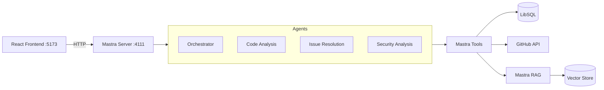
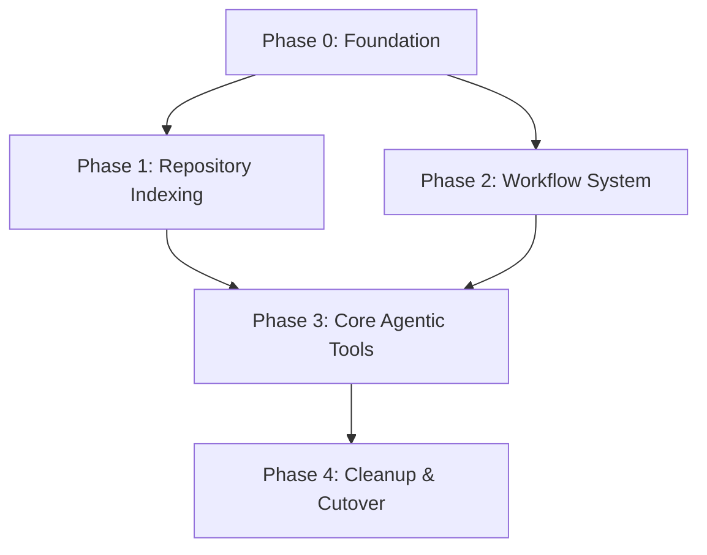

# Specification: LlamaIndex to Mastra Agent Migration

## Quick Reference
| Aspect | Value |
|--------|-------|
| Complexity | High |
| Files to Create | ~20-25 TypeScript files |
| Files to Delete | 21 Python files (~507 KB in agent_tools/ + 65 KB elsewhere) |
| Files to Modify | ~10 files |
| Estimated Phases | 5 (including Phase 0: Foundation) |
| Key Dependencies | @mastra/core, @mastra/rag, @mastra/libsql, @mastra/memory |
| Verification Command | `pnpm --filter mastra build && pnpm --filter mastra dev` |

## Overview

Migrate triage.flow's agentic system from Python (LlamaIndex) to TypeScript (Mastra), removing ~22,000 lines of Python code and replacing with a cleaner, more maintainable Mastra-based architecture. The migration follows a feature-by-feature approach, with parallel runs to verify parity.

**Critical Finding**: Current Mastra tools are HTTP proxies to Python API, NOT native implementations. Migration progress is ~5%, not 30% as initially assumed.

## Problem Statement

### The Problem
The current Python-based agentic system using LlamaIndex suffers from:
1. **Code complexity**: ~1000 lines in `llamaindex_workflows.py` alone for event-driven workflow orchestration
2. **Maintenance burden**: Complex event wiring, manual step management, difficult debugging
3. **Language fragmentation**: TypeScript frontend + Python backend creates friction
4. **Feature limitations**: LlamaIndex lacks built-in workflow orchestration, memory management, and tooling that Mastra provides

### Current State
```
                     Current Architecture

  React Frontend (issue-flow-ai-prompt) :5173
        |
        v
  Python FastAPI :8000
        |
        +-- LlamaIndex Workflows (llamaindex_*.py)
        +-- Agent Pool (agent_pool.py)
        +-- Context Manager (context_manager.py)
        +-- Tool Registry (tool_registry.py)
        +-- RAG System (issue_rag.py, agentic_rag.py)
        |
        v
  SQLite/PostgreSQL + Redis

  Mastra Transition Layer (CURRENT - Proxy Only)
  React Frontend --> Mastra :4111 --> Python API :8000
  (All 7 tools just proxy to Python via HTTP)
```

### Impact of Not Solving
- Continued maintenance burden with complex LlamaIndex event wiring
- Language context switching slows development velocity
- Missing features that Mastra provides (structured workflows, agent networks, built-in observability)
- Technical debt accumulation in the Python agentic layer

## Goals & Success Metrics

### Goals
- **Primary**: Replace all Python agentic code with Mastra TypeScript equivalents (native, not proxies)
- **Secondary**: Reduce total code by 40%+ while maintaining feature parity
- **Tertiary**: Enable future features (multi-modal agents, streaming, better observability)

### Non-Goals (Out of Scope)
- Changing the React frontend architecture
- Migrating the data layer (LibSQL will be used by Mastra)
- Adding new agent capabilities not present in current system
- Changing external integrations (GitHub API patterns remain the same)

### Success Criteria
- All current API endpoints work with Mastra backend
- Parallel runs show equivalent output quality (>95% similarity)
- Response latency within 20% of Python implementation
- Zero Python agentic code in production after migration complete
- Frontend works without modifications (same API contracts)

## Solution Design

### Approach
Feature-by-feature migration with parallel runs for verification:
0. **Foundation** (NEW) - Install dependencies, implement core infrastructure
1. **Repository Indexing** - Native session creation, code indexing, status tracking
2. **Workflow System** - Replace LlamaIndex workflows with Mastra workflows
3. **Core Agentic System** - Migrate tools, context management, query processing
4. **Cleanup** - Remove Python dependencies, finalize migration

### Target Architecture



### Component Details
| Component | Purpose | Port/Endpoint | Technology |
|-----------|---------|---------------|------------|
| Mastra Server | Agent orchestration & API | :4111 | @mastra/core |
| Agent Network | Multi-agent coordination | Internal | Mastra Workflows |
| Mastra RAG | Semantic code search | Internal | @mastra/rag |
| LibSQL Store | Agent memory & state | file:./mastra.db | @mastra/libsql |
| GitHub Tools | Issue/PR/Repo operations | HTTP | Custom Mastra tools |

## Environment Variables

### Required Environment Variables
| Variable | Description | Example |
|----------|-------------|---------|
| `OPENAI_API_KEY` | OpenAI API key for LLM | `sk-...` |
| `GITHUB_TOKEN` | GitHub Personal Access Token | `ghp_...` |
| `DATABASE_URL` | LibSQL database URL | `file:./mastra.db` |

### Optional Environment Variables
| Variable | Description | Default |
|----------|-------------|---------|
| `PYTHON_API_URL` | Python API for transition period | `http://localhost:8000` |
| `MASTRA_LOG_LEVEL` | Logging level | `info` |
| `MASTRA_SERVER_TIMEOUT` | Server request timeout (ms) | `30000` |

## Frontend API Contracts

The React frontend expects specific API shapes. Mastra must replicate these exactly.

### Session APIs (snake_case responses required)
| Endpoint | Method | Request | Response |
|----------|--------|---------|----------|
| `/assistant/sessions` | POST | `{ repo_url, initial_file?, session_name? }` | `{ session_id, repo_metadata, status, message }` |
| `/assistant/sessions` | GET | `?session_type=` | `{ sessions: SessionInfo[], total }` |
| `/assistant/sessions/{id}/status` | GET | - | `{ status, progress?, message? }` |
| `/assistant/sessions/{id}` | DELETE | - | - |
| `/assistant/sessions/{id}/metadata` | GET | - | Session metadata |
| `/assistant/sessions/{id}/messages` | GET | - | `{ session_id, messages, total_messages }` |
| `/assistant/sessions/{id}/agentic-query` | POST | `{ role, content, context_files? }` | SSE stream |

### File APIs
| Endpoint | Method | Request | Response |
|----------|--------|---------|----------|
| `/api/tree` | GET | `?session_id=` | `FileTreeNode[]` |
| `/api/file-content` | GET | `?session_id=&file_path=` | `{ content, size, type }` |

### Issue Analysis APIs
| Endpoint | Method | Request | Response |
|----------|--------|---------|----------|
| `/api/analyze-issue` | POST | `{ issue_url, session_id? }` | `{ session_id, steps, final_result, status }` |
| `/api/cached-analyses/{sessionId}` | GET | - | `{ cached_analyses, repository, session_id }` |

**IMPORTANT**: Mastra returns camelCase by default. Must transform to snake_case for frontend compatibility.

## File Structure & References

### Files to Create

#### Phase 0: Foundation Infrastructure
| File Path | Purpose | LOC Est |
|-----------|---------|---------|
| `mastra/src/mastra/rag/codebaseRag.ts` | Native code indexing & search | 400 |
| `mastra/src/mastra/rag/issueRag.ts` | Issue-aware RAG | 300 |
| `mastra/src/mastra/rag/compositeRetriever.ts` | Multi-index retrieval | 250 |
| `mastra/src/mastra/context/contextManager.ts` | Tool coordination & execution tracking | 500 |
| `mastra/src/mastra/query/queryProcessor.ts` | Query complexity analysis | 200 |

#### Phase 1-3: Tools & Agents
| File Path | Purpose | Template/Pattern |
|-----------|---------|------------------|
| `mastra/src/mastra/workflows/analysisWorkflow.ts` | Main analysis workflow | Mastra workflow pattern |
| `mastra/src/mastra/workflows/repositoryIndexing.ts` | Repo indexing workflow | Mastra workflow pattern |
| `mastra/src/mastra/tools/gitOperations.ts` | Git blame, history, commits | Native (simple-git) |
| `mastra/src/mastra/tools/issueOperations.ts` | GitHub issue operations | Native (Octokit) |
| `mastra/src/mastra/tools/prOperations.ts` | PR operations | Native |
| `mastra/src/mastra/tools/codeGeneration.ts` | Code generation tool | LLM-based |
| `mastra/src/mastra/tools/fileOperations.ts` | File reading, tree generation | Native (fs) |
| `mastra/src/mastra/tools/searchOperations.ts` | Code search | Native |
| `mastra/src/mastra/memory/agentMemory.ts` | Thread/resource-scoped memory | @mastra/memory |
| `mastra/src/mastra/agents/securityAgent.ts` | Security analysis agent | Follow agent pattern |
| `mastra/src/mastra/agents/qualityAgent.ts` | Code quality agent | Follow agent pattern |
| `mastra/src/mastra/server/routes.ts` | Custom API routes (snake_case) | registerApiRoute |
| `mastra/src/mastra/server/middleware.ts` | Case transformation middleware | Hono middleware |

### Files to Delete (VERIFIED SIZES)

#### Phase 1 Deletions (After native tools ready)
| File Path | Size | Lines Est |
|-----------|------|-----------|
| `src/agent_tools/llamaindex_workflows.py` | 41.0 KB | 987 |
| `src/agent_tools/llamaindex_comprehensive_workflow.py` | 42.0 KB | 967 |
| `src/agent_tools/workflow_state.py` | 14.8 KB | 350 |
| `src/agent_tools/workflow_agents.py` | 16.5 KB | 400 |
| `src/agent_tools/agent_pool.py` | 3.1 KB | 62 |

#### Phase 3 Deletions (After full migration)
| File Path | Size | Lines Est |
|-----------|------|-----------|
| `src/agent_tools/core.py` | 10.5 KB | 208 |
| `src/agent_tools/tool_registry.py` | 19.8 KB | 450 |
| `src/agent_tools/context_manager.py` | 20.8 KB | 464 |
| `src/agent_tools/context_aware_tools.py` | 32.7 KB | 673 |
| `src/agent_tools/query_processor.py` | 23.3 KB | 538 |
| `src/agent_tools/response_handling.py` | 19.8 KB | 455 |
| `src/agent_tools/code_generation.py` | 24.3 KB | 500 |
| `src/agent_tools/file_operations.py` | 13.5 KB | 300 |
| `src/agent_tools/search_operations.py` | 13.1 KB | 290 |
| `src/agent_tools/git_operations.py` | 20.9 KB | 450 |
| `src/agent_tools/issue_operations.py` | 38.2 KB | 784 |
| `src/agent_tools/pr_operations.py` | 19.5 KB | 420 |
| `src/agent_tools/prompts.py` | 14.1 KB | 300 |
| `src/agent_tools/utilities.py` | 7.9 KB | 170 |
| `src/agent_tools/llm_config.py` | 3.7 KB | 80 |
| `src/agent_tools/__init__.py` | 2.6 KB | 60 |

#### Phase 4 Deletions (Cleanup)
| File Path | Size | Lines Est |
|-----------|------|-----------|
| `src/api/routers/workflows.py` | 31.7 KB | 835 |
| `src/api/routers/agentic.py` | 35.8 KB | 792 |
| `src/founding_member_agent.py` | 29.2 KB | 592 |
| `src/agentic_rag.py` | 19.5 KB | 400 |

**Total: 21 files in agent_tools/ (~507 KB) + 4 files elsewhere (~116 KB) = ~623 KB**

### Files to Modify
| File Path | Change Description | Priority |
|-----------|-------------------|----------|
| `mastra/package.json` | Add @mastra/rag | Phase 0 |
| `mastra/src/mastra/index.ts` | Add new agents, workflows, RAG | Phase 1 |
| `mastra/src/mastra/agents/index.ts` | Export new agents | Phase 2 |
| `mastra/src/mastra/tools/index.ts` | Export new tools, remove proxies | Phase 2 |
| `mastra/src/mastra/tools/createSession.ts` | Replace HTTP proxy with native | Phase 1 |
| `mastra/src/mastra/tools/searchCodebase.ts` | Replace HTTP proxy with native | Phase 1 |
| `mastra/src/mastra/tools/analyzeIssue.ts` | Replace HTTP proxy with native | Phase 2 |
| `issue-flow-ai-prompt/src/lib/api.ts` | Point to Mastra API (if needed) | Phase 4 |

### Current Mastra Package Dependencies
```json
{
  "dependencies": {
    "@ai-sdk/openai": "^1.3.0",
    "@ai-sdk/anthropic": "^1.2.0",
    "@mastra/core": "^0.24.9",
    "@mastra/memory": "^0.15.13",   // ALREADY INSTALLED - unused
    "@mastra/libsql": "^0.16.4",
    "@mastra/loggers": "^0.10.19",
    "dotenv": "^16.4.0",
    "zod": "^3.25.0"
  }
}
```

**To Add:**
```json
{
  "@mastra/rag": "^0.x.x",           // For RAG functionality
  "simple-git": "^3.x.x",            // For native git operations
  "@octokit/rest": "^20.x.x"         // For GitHub API (if not using existing)
}
```

### Codebase Patterns to Follow

#### Mastra Step Definition (NOT declarative conditions)
```typescript
// CORRECT: Conditions inside execute()
const analysisStep = createStep({
  id: "analysis",
  inputSchema: z.object({ query: z.string() }),
  outputSchema: z.object({ needsSecurityCheck: z.boolean(), result: z.any() }),
  execute: async ({ inputData, mastra }) => {
    const result = await analyzeCode(inputData.query);
    // Conditional logic INSIDE execute, not declarative
    const needsSecurityCheck = result.hasSecurityPatterns;
    return { needsSecurityCheck, result };
  }
});
```

#### Mastra Memory (Thread + Resource scoping)
```typescript
// CORRECT: Use thread and resource scoping
const memory = new Memory({
  storage: new LibSQLStore({ url: "file:./agent-memory.db" }),
  options: {
    lastMessages: 10,
    semanticRecall: {
      topK: 3,
      messageRange: 2,
      scope: "thread"  // or "resource" for cross-thread
    }
  }
});
```

## Detailed Requirements

### Functional Requirements
- **FR-1**: Repository session creation with GitHub URL validation (native, no Python proxy)
- **FR-2**: Code indexing with progress tracking and status polling
- **FR-3**: Multi-agent workflow execution with orchestrator coordination
- **FR-4**: Semantic code search using Mastra RAG
- **FR-5**: GitHub issue analysis with related code discovery
- **FR-6**: Agent memory persistence using thread/resource scoping
- **FR-7**: Streaming responses for long-running agent operations (SSE)
- **FR-8**: Session status with indexing progress percentage
- **FR-9**: API responses in snake_case for frontend compatibility

### Non-Functional Requirements
- **NFR-1**: Response latency within 20% of Python implementation
- **NFR-2**: Agent memory scoped per-thread with optional resource-level sharing
- **NFR-3**: Graceful degradation when GitHub API is unavailable
- **NFR-4**: All agents use same LLM configuration (gpt-4o default)
- **NFR-5**: Tool execution logging for debugging
- **NFR-6**: Server timeout configurable (>30s for indexing operations)

## Implementation Plan

### Phase Dependencies



### Phase Details

#### Phase 0: Foundation Infrastructure (NEW - BLOCKING)
- **Files**:
  - Create: `mastra/src/mastra/rag/codebaseRag.ts`
  - Create: `mastra/src/mastra/context/contextManager.ts`
  - Create: `mastra/src/mastra/query/queryProcessor.ts`
  - Modify: `mastra/package.json` (add @mastra/rag, simple-git)
- **Tasks**:
  - [ ] Install @mastra/rag package
  - [ ] Implement CodebaseRag with document chunking and embedding
  - [ ] Implement ContextManager for tool coordination
  - [ ] Implement QueryProcessor for complexity analysis
  - [ ] Choose and configure embedder (recommend OpenAI text-embedding-3-small)
  - [ ] Verify LibSQL cosine similarity meets code search needs
- **Verification**:
  - `pnpm --filter mastra tsc --noEmit`
  - Unit test: Index sample repo, query returns relevant results
- **Success Criteria**:
  - RAG can index a repository
  - Semantic search returns relevant code chunks
  - Context manager tracks tool executions
- **Blocks**: Phase 1, Phase 2

#### Phase 1: Repository Indexing (Depends on Phase 0)
- **Files**:
  - Modify: `mastra/src/mastra/tools/createSession.ts` (native implementation)
  - Modify: `mastra/src/mastra/tools/searchCodebase.ts` (native implementation)
  - Create: `mastra/src/mastra/workflows/repositoryIndexing.ts`
  - Create: `mastra/src/mastra/server/routes.ts` (custom API routes)
- **Tasks**:
  - [ ] Replace HTTP proxy in createSession with native RAG indexing
  - [ ] Replace HTTP proxy in searchCodebase with native vector query
  - [ ] Create repository indexing workflow with progress tracking
  - [ ] Add custom routes matching Python API paths
  - [ ] Implement snake_case response transformation
  - [ ] Set up parallel runs infrastructure
- **Verification**:
  - `curl localhost:4111/assistant/sessions -d '{"repo_url":"..."}'`
  - Compare session creation time and status between systems
- **Success Criteria**:
  - Session creation works end-to-end without Python
  - Indexing completes with status tracking
  - < 20% latency difference from Python
  - Frontend can connect without changes
- **Blocks**: Phase 3

#### Phase 2: Workflow System (Depends on Phase 0)
- **Files**:
  - Create: `mastra/src/mastra/workflows/analysisWorkflow.ts`
  - Create: `mastra/src/mastra/agents/securityAgent.ts`
  - Create: `mastra/src/mastra/agents/qualityAgent.ts`
  - Create: `mastra/src/mastra/memory/agentMemory.ts`
- **Tasks**:
  - [ ] Implement analysis workflow with conditional logic in execute blocks
  - [ ] Add security and quality agents
  - [ ] Implement agent handoff patterns via workflow state
  - [ ] Configure thread-scoped memory with semantic recall
  - [ ] Port workflow state management to Mastra state/setState
- **Verification**:
  - Execute same analysis query on both systems
  - Compare agent execution patterns and results
- **Success Criteria**:
  - Multi-agent workflow executes correctly
  - Agent handoffs work via workflow state
  - Results quality matches Python system
  - Memory persists across requests
- **Blocks**: Phase 4

#### Phase 3: Core Agentic Tools (Depends on Phase 1)
- **Files**:
  - Create: `mastra/src/mastra/tools/gitOperations.ts`
  - Create: `mastra/src/mastra/tools/issueOperations.ts`
  - Create: `mastra/src/mastra/tools/prOperations.ts`
  - Create: `mastra/src/mastra/tools/codeGeneration.ts`
  - Create: `mastra/src/mastra/tools/fileOperations.ts`
  - Modify: `mastra/src/mastra/tools/analyzeIssue.ts` (native implementation)
- **Tasks**:
  - [ ] Implement git operations using simple-git (blame, history, diff)
  - [ ] Implement issue operations using Octokit (triage, analysis, context)
  - [ ] Implement PR operations
  - [ ] Implement code generation tool
  - [ ] Implement file operations (read, tree)
  - [ ] Port query complexity analysis
- **Verification**:
  - Run same tools on both systems
  - Compare output format and content
- **Success Criteria**:
  - All tools produce equivalent output
  - No HTTP proxies to Python remain
- **Blocks**: Phase 4

#### Phase 4: Cleanup & Cutover (Depends on Phase 2, Phase 3)
- **Files**:
  - Delete: All files listed in "Files to Delete" sections
  - Modify: `requirements.txt` (remove llama-index)
- **Tasks**:
  - [ ] Run final parallel validation (>95% similarity)
  - [ ] Verify all frontend operations work
  - [ ] Delete Python agentic code (21+ files)
  - [ ] Remove llama-index from requirements.txt
  - [ ] Remove Redis dependency if no longer needed
  - [ ] Update deployment configuration
  - [ ] Update documentation
- **Verification**:
  - Full E2E test with frontend
  - Production smoke test
- **Success Criteria**:
  - Frontend works with zero code changes
  - All Python agentic code removed
  - No llama-index or Redis dependencies

### Technical Decisions
| Decision | Choice | Rationale |
|----------|--------|-----------|
| Database | LibSQL (keep) | Already working, Mastra supports it |
| Orchestration | Mastra Workflows | Native workflow support with state/setState |
| Workflow conditions | Inside execute() | Mastra doesn't support declarative step conditions |
| Multi-agent | Workflow state sharing | Steps share data via state/setState |
| RAG | @mastra/rag | Native integration, less code than custom |
| Memory | Thread-scoped | Uses resource + thread identifiers, not agent type |
| Embedder | OpenAI text-embedding-3-small | Good quality, reasonable cost |
| Vector similarity | Cosine (LibSQL) | Only option with LibSQL, verify fits use case |
| LLM | gpt-4o | Current model, Mastra supports via @ai-sdk/openai |
| API responses | snake_case | Frontend compatibility requirement |
| Server timeout | 120s for indexing | Default 30s too short for repo indexing |

### Data Migration Strategy
| Data Type | Source | Target | Migration Approach |
|-----------|--------|--------|-------------------|
| Session state | Python SQLite | Mastra LibSQL | Export/import script |
| Indexed repos | Python vector store | Mastra RAG store | Re-index fresh (recommended) |
| Agent memory | Python Redis | Mastra LibSQL | Fresh start (new architecture) |

### Risks & Mitigations
| Risk | Impact | Mitigation |
|------|--------|------------|
| Performance regression | User experience degrades | Parallel runs, latency monitoring |
| Missing functionality | Features don't work | Comprehensive feature checklist |
| Data loss during migration | Lost sessions/indexes | Export script, re-indexing capability |
| Frontend breaks | UI unusable | Keep Python running until verified |
| Mastra version changes | Breaking changes | Pin specific @mastra versions |
| LibSQL cosine similarity insufficient | Poor search results | Test with real queries, consider pgvector if needed |
| Server timeout too short | Indexing fails | Configure 120s+ timeout |

## Edge Cases & Error Handling

| Scenario | Expected Behavior | Log Level |
|----------|-------------------|-----------|
| GitHub API rate limit | Return 429, retry with backoff | WARN |
| Repository not found | Return 404 with clear message | ERROR |
| Session not indexed yet | Return 202 with progress % | INFO |
| LLM timeout | Retry once, then fail gracefully | ERROR |
| Invalid GitHub URL | Return 400 with validation error | WARN |
| Memory thread not found | Create new thread | INFO |
| Workflow timeout | Complete partial results, note incomplete | ERROR |
| Vector search no results | Return empty array, suggest broader query | INFO |

## Verification & Testing

### Verification Commands
| Step | Command | Expected Output |
|------|---------|-----------------|
| Types compile | `pnpm --filter mastra tsc --noEmit` | No errors |
| Mastra builds | `pnpm --filter mastra build` | Build complete |
| Mastra runs | `pnpm --filter mastra dev` | Server on :4111 |
| Agent test | `curl localhost:4111/api/agents/orchestrator/generate -d '{...}'` | Valid response |
| Session create | `curl -X POST localhost:4111/assistant/sessions -d '{"repo_url":"..."}'` | `{session_id, status}` |
| Parallel run | `./scripts/parallel-validation.sh` | >95% similarity |

### Parallel Run Protocol
```bash
#!/bin/bash
# scripts/parallel-validation.sh

# For each test case:
# 1. Send request to Python API (:8000)
# 2. Send identical request to Mastra API (:4111)
# 3. Compare responses:
#    - Structure match (same fields)
#    - Content similarity (cosine similarity on text)
#    - Latency comparison
#    - Error handling consistency
# 4. Log discrepancies for investigation

TEST_CASES=(
  "create_session|POST|/assistant/sessions|{\"repo_url\":\"https://github.com/facebook/react\"}"
  "search_code|POST|/assistant/sessions/{id}/agentic-query|{\"content\":\"authentication middleware\"}"
  "analyze_issue|POST|/api/analyze-issue|{\"issue_url\":\"https://github.com/...\"}"
)

for case in "${TEST_CASES[@]}"; do
  # Parse and execute...
done
```

### Test Cases
| ID | Description | Type | Input |
|----|-------------|------|-------|
| TC-1 | Create session for public repo | E2E | `{repo_url: "github.com/facebook/react"}` |
| TC-2 | Create session for private repo | E2E | `{repo_url: "github.com/org/private"}` |
| TC-3 | Search indexed codebase | E2E | `{query: "authentication middleware"}` |
| TC-4 | Analyze GitHub issue | E2E | `{issue_url: "github.com/.../issues/123"}` |
| TC-5 | Multi-agent workflow | E2E | Comprehensive analysis query |
| TC-6 | Agent memory persistence | Unit | Create, retrieve, update memory |
| TC-7 | Workflow state transitions | Unit | Workflow step execution |
| TC-8 | API response format | Unit | Verify snake_case responses |

## Debugging & Observability

### Logging Points
| Event | Log Level | Message Format |
|-------|-----------|----------------|
| Agent invoked | INFO | `"Agent ${name} invoked with: ${input}"` |
| Tool executed | DEBUG | `"Tool ${toolId} executed in ${ms}ms"` |
| Workflow step | INFO | `"Workflow step ${step} completed"` |
| GitHub API call | DEBUG | `"GitHub API: ${method} ${endpoint}"` |
| Memory operation | DEBUG | `"Memory ${op}: thread=${threadId}"` |
| RAG query | DEBUG | `"RAG query: ${query} returned ${count} results"` |
| Error | ERROR | `"Error in ${component}: ${message}"` |

### Metrics to Track
- Agent invocation count per type
- Tool execution latency (p50, p95, p99)
- Workflow completion rate
- GitHub API call count and errors
- RAG query latency and result count
- Memory operations per thread

### Performance Monitoring
| Metric | Python Baseline | Mastra Target | Alert Threshold |
|--------|-----------------|---------------|-----------------|
| Session creation | 2-3s | <3.5s | >5s |
| Code search | 1-2s | <2.5s | >4s |
| Issue analysis | 5-10s | <12s | >20s |
| Full workflow | 30-60s | <75s | >120s |

## Rollback Plan

### Quick Rollback
```bash
# If Mastra fails, revert to Python:
1. Update frontend API_URL to Python (:8000)
2. Restart Python server
3. Monitor for stability
```

### Partial Rollback
If specific features fail:
```bash
# Keep Mastra for working features, route failing ones to Python:
# Configure Mastra to proxy specific routes to Python
# Use feature flags to control routing
```

### Full Revert
```bash
git checkout main -- mastra/  # Reset Mastra changes
git checkout main -- src/     # Restore Python code
# Redeploy Python version
```

## Open Questions

1. **Vector store performance**: Is LibSQL cosine similarity sufficient for code search quality, or should we consider pgvector?
   - Recommendation: Test with real queries first, migrate to pgvector only if needed

2. **Streaming implementation**: Should we use SSE (current) or WebSocket for agent responses?
   - Recommendation: Keep SSE for compatibility with existing frontend

3. **Redis removal timing**: When can we safely remove Redis dependency?
   - Recommendation: After Phase 4, verify no other services depend on it

4. **Mastra Studio**: Keep for dev/debug even though production uses React UI?
   - Recommendation: Yes, valuable for debugging agent behavior

5. **Re-indexing strategy**: How to handle existing indexed repositories during migration?
   - Recommendation: Re-index fresh; cleaner than migrating vectors

## References

- [Mastra Documentation](https://mastra.ai/docs)
- [Mastra RAG Guide](https://mastra.ai/docs/rag/overview)
- [Mastra Workflows - Step Class](https://mastra.ai/reference/workflows/step)
- [Mastra Memory Class](https://mastra.ai/reference/memory/memory-class)
- [Mastra Agent Memory](https://mastra.ai/docs/agents/agent-memory)
- [Current Python Implementation](./src/agent_tools/)
- [Existing Mastra Setup](./mastra/src/mastra/)
- [Frontend API Client](./issue-flow-ai-prompt/src/lib/api.ts)

---
*Generated by /spec:init*
*Intent detected: UNCLEAR*
*Date: 2026-01-02*
*Revision: 2 - Updated with verified file sizes, corrected Mastra patterns, added Phase 0*
