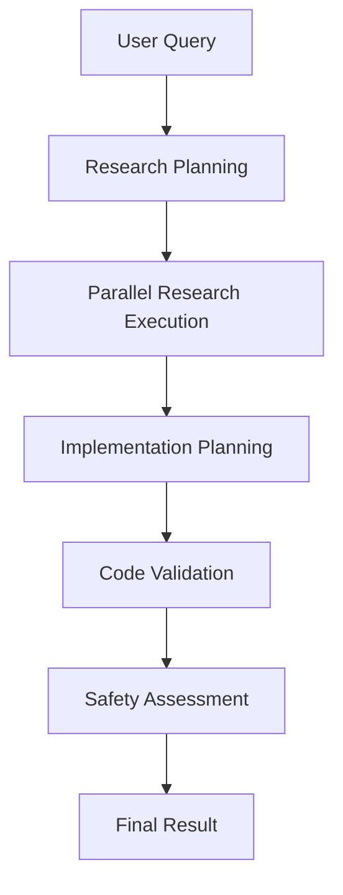

# Multi-Agent Codebase Intelligence System

A sophisticated AI-powered system that combines code analysis, issue intelligence, and pattern recognition for intelligent software development assistance.

## 🎯 Overview

This multi-agent system orchestrates specialized AI agents to provide comprehensive analysis and implementation assistance for software development tasks. It leverages your existing codebase knowledge, issue history, and development patterns to generate intelligent solutions.

## 🏗️ Architecture

### Core Components

1. **CodebaseIntelligenceWorkflow** - Main orchestrator that coordinates all agents
2. **ResearchPlannerAgent** - Plans and organizes research tasks based on queries
3. **CodeAnalysisAgent** - Performs deep code analysis and pattern detection
4. **ImplementationAgent** - Generates implementation plans and code
5. **CodeValidator** - Validates generated code for safety and quality
6. **SafetyGate** - Ensures human oversight for risky operations

### Workflow Stages



## 🚀 Features

### Research & Analysis
- **Intelligent Query Planning** - Breaks down complex requests into research tasks
- **Parallel Execution** - Runs multiple analysis tasks simultaneously for speed
- **Multi-Domain Knowledge** - Combines code patterns, issue history, and git history
- **Pattern Recognition** - Identifies successful implementation patterns

### Code Generation
- **Context-Aware Generation** - Uses codebase patterns and conventions
- **Language Detection** - Automatically detects and uses appropriate languages
- **Best Practices** - Incorporates established patterns from the codebase
- **Comprehensive Examples** - Generates complete, runnable code

### Safety & Validation
- **Syntax Validation** - Ensures generated code is syntactically correct
- **Security Scanning** - Detects potentially dangerous patterns
- **Risk Assessment** - Evaluates implementation complexity and risks
- **Human-in-the-Loop** - Requires approval for high-risk operations

### Performance Monitoring
- **Stage Timing** - Tracks performance of each workflow stage
- **Confidence Scoring** - Provides confidence metrics for results
- **Error Handling** - Graceful degradation with fallback strategies

## 📋 Usage

### Basic Usage

```python
from src.multi_agent import CodebaseIntelligenceWorkflow

# Initialize the workflow
workflow = CodebaseIntelligenceWorkflow(
    session_id="my_session",
    repo_path="/path/to/your/repo",
    timeout=300
)

# Process a query
result = await workflow.process_query(
    "Create a user authentication system"
)

print(f"Status: {result['summary']['status']}")
print(f"Approved: {result['approved']}")
```

### Streaming Usage

```python
# Stream progress updates
async for event in workflow.stream_process_query("Add logging to the API"):
    if event["type"] == "progress":
        print(f"[{event['progress']:.1f}%] {event['agent']}: {event['task']}")
    elif event["type"] == "result":
        final_result = event["data"]
        break
```

### Integration with Existing Systems

```python
from src.agentic_tools import AgenticCodebaseExplorer
from src.issue_rag import IssueAwareRAG

# Use with existing components
explorer = AgenticCodebaseExplorer(session_id, repo_path)
issue_rag = IssueAwareRAG(owner, repo_name)
await issue_rag.initialize()

workflow = CodebaseIntelligenceWorkflow(
    session_id=session_id,
    repo_path=repo_path,
    issue_rag_system=issue_rag
)
```

## 🎮 Demo & Testing

### Run Quick Test
```bash
cd src/multi_agent
python demo.py quick
```

### Run Streaming Demo
```bash
python demo.py stream
```

### Run Comprehensive Demo
```bash
python demo.py
```

### Example Output
```
🚀 Multi-Agent Codebase Intelligence System Demo
============================================================
Session ID: demo_1703123456
Repository: /path/to/repo

🔧 Initializing multi-agent system...
✅ Multi-agent system initialized successfully!

🎯 Running Demo 1/5
================================================================================
DEMO: Feature Development - Authentication System
Query: Create a simple user authentication system
================================================================================

📊 RESULTS (completed in 45.23s)
Status: requires_review
Risk Level: HIGH
Code Valid: True
Approved: False

💻 GENERATED CODE PREVIEW:
 1: import hashlib
 2: import jwt
 3: from datetime import datetime, timedelta
 4: from typing import Optional, Dict
 5: 
 6: class UserAuthenticator:
 7:     def __init__(self, secret_key: str):
 8:         self.secret_key = secret_key
 9:         self.users = {}  # In production, use a database
10:     
    ... (more lines)

📝 FEEDBACK:
1. Risk assessment: High risk factors detected: security_sensitive
2. Implementation requires security review before deployment
3. Consider using established authentication libraries

📋 RECOMMENDED NEXT STEPS:
1. Implementation requires review before proceeding
2. Address the required changes listed in feedback
3. Consider manual review of high-risk components
```

## 🔧 Configuration

### Environment Variables
```bash
# Required
OPENAI_API_KEY=your_openai_api_key
GITHUB_TOKEN=your_github_token  # For issue analysis

# Optional
MAX_ISSUES_TO_PROCESS=1000
MAX_PR_TO_PROCESS=500
```

### Workflow Parameters
```python
workflow = CodebaseIntelligenceWorkflow(
    session_id="unique_session_id",
    repo_path="/path/to/repository",
    issue_rag_system=None,  # Optional: IssueAwareRAG instance
    timeout=300,  # Maximum execution time in seconds
    verbose=True  # Enable detailed logging
)
```

## 🛡️ Safety Features

### Risk Assessment
The system automatically assesses implementation risk based on:
- **Code Complexity** - Number of steps and code length
- **File Operations** - Creating, modifying, or deleting files
- **External Dependencies** - Use of external libraries or APIs
- **Security Sensitivity** - Authentication, encryption, or data handling
- **Data Operations** - Database modifications or file system access

### Approval Workflow
- **Low Risk** (1-4): Auto-approved
- **Medium Risk** (4-6): Approved with conditions
- **High Risk** (6-8): Requires human review
- **Critical Risk** (8-10): Rejected for automated implementation

### Code Validation
- Syntax checking for multiple languages
- Import validation
- Security pattern detection
- Code quality suggestions

## 📊 Performance Characteristics

### Typical Performance
- **Simple Queries** (e.g., "Add logging"): 15-30 seconds
- **Medium Complexity** (e.g., "Create API endpoint"): 30-60 seconds
- **High Complexity** (e.g., "Refactor architecture"): 60-120 seconds

### Optimization Features
- **Parallel Execution** - Research tasks run simultaneously
- **Caching** - Reuses analysis results within sessions
- **Intelligent Planning** - Adapts research depth to query complexity
- **Fallback Strategies** - Graceful degradation on failures

## 🔍 Troubleshooting

### Common Issues

1. **Timeout Errors**
   ```python
   # Increase timeout for complex queries
   workflow = CodebaseIntelligenceWorkflow(timeout=600)
   ```

2. **Missing Dependencies**
   ```bash
   pip install llama-index openai faiss-cpu
   ```

3. **GitHub API Rate Limits**
   ```python
   # Reduce max issues processed
   export MAX_ISSUES_TO_PROCESS=100
   ```

### Debug Mode
```python
import logging
logging.basicConfig(level=logging.DEBUG)

# Run with verbose logging
workflow = CodebaseIntelligenceWorkflow(verbose=True)
```

## 🤝 Contributing

### Adding New Agents
1. Inherit from `BaseAgent`
2. Implement required methods
3. Add to workflow orchestration
4. Update validation rules

### Extending Validation
1. Add new patterns to `CodeValidator`
2. Update risk assessment in `SafetyGate`
3. Test with various code examples

## 📈 Roadmap

### Planned Features
- **Real-time Collaboration** - Multiple developers working simultaneously
- **Code Review Integration** - Automatic PR creation and review
- **CI/CD Integration** - Automatic testing and deployment
- **Custom Agent Creation** - User-defined specialized agents
- **Performance Optimization** - Faster execution and better caching

### Integration Targets
- GitHub Actions
- VS Code Extension
- Slack/Discord Bots
- Project Management Tools

## 📄 License

This multi-agent system is part of the larger codebase intelligence project. See the main project license for details.

## 🙋‍♂️ Support

For questions, issues, or contributions:
1. Check the troubleshooting section
2. Review existing issues
3. Create a detailed issue report
4. Consider contributing a fix or enhancement

---

**Built with ❤️ for intelligent software development** 